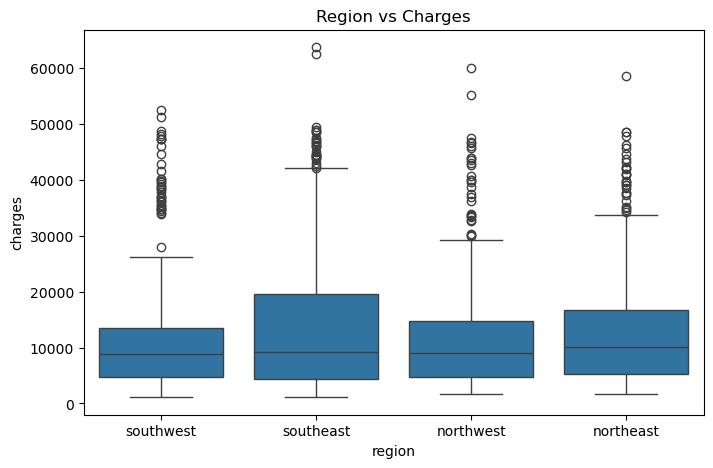
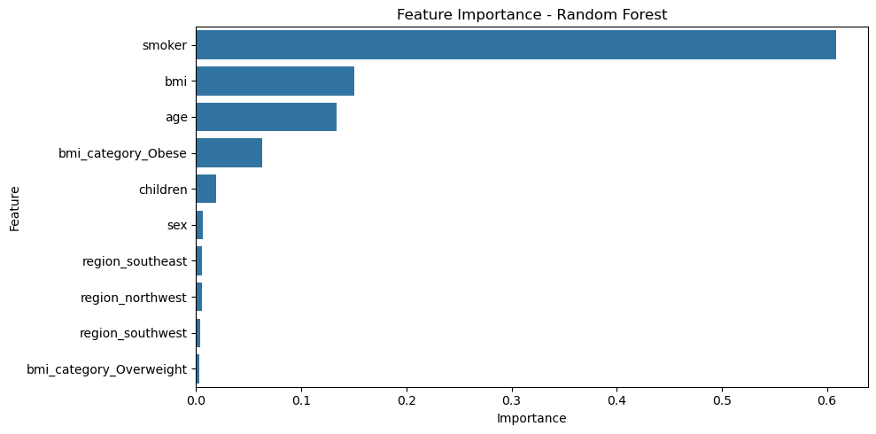

# 🏥 Healthcare Insurance Cost Predictor

An **end-to-end Machine Learning + Streamlit project** that predicts an individual’s **annual health insurance premium** using demographic and health-related information.

- 🧠 **Model:** Random Forest Regression (trained on the *Medical Cost Personal Dataset*)  
- 🚀 **Deployment:** Streamlit  
- 📓 **Development:** Jupyter Notebook  

---

## 🔗 Live App
👉 [Try the App on Streamlit](#)

---

## 📘 Project Overview

This project predicts yearly insurance charges based on several key factors:

- Age  
- Gender  
- BMI  
- Number of Children  
- Smoking Status  
- Residential Region  

The workflow includes **data exploration**, **feature engineering**, **model training**, and deployment via a **Streamlit web interface**.

---

## 📊 Sample Visualizations

### 📈 Region vs Charges (Boxplot)

### Feature Importance (Random Forest)

---

## 🧠 Key Features

- Predicts **annual insurance cost** using a trained Random Forest model  
- Includes **feature importance analysis**  
- Handles **categorical encoding** and **BMI-based obesity classification**  
- Offers an **interactive user interface** via Streamlit  

---

## 🛠 Technologies Used

- **Python**  
- **Pandas**, **NumPy**  
- **scikit-learn** (Random Forest Regressor)  
- **Seaborn**, **Matplotlib**  
- **Streamlit** (for app deployment)  
- **Jupyter Notebook**  

---

## 📁 Project Structure

| File | Description |
|------|--------------|
| `insurance.csv` | Original dataset |
| `Healthcare_Insurance_Cost_Prediction.ipynb` | Notebook with EDA and model training |
| `model.pkl` | Trained ML model |
| `app.py` | Streamlit app script |
| `requirements.txt` | Project dependencies |
| `children_vs_charges.png` | Visualization: Children vs Charges |
| `feature_importance.png` | Visualization: Feature Importance |

---

